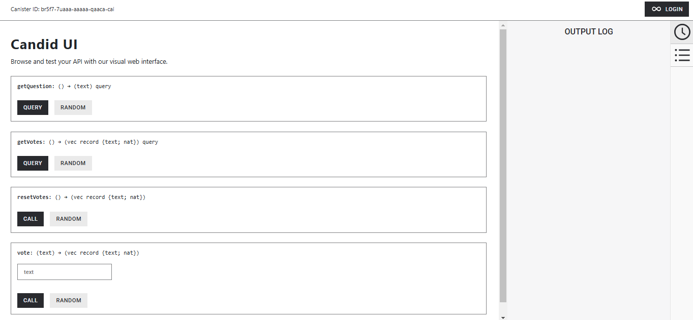

# Poll Dapp Tutorial

Welcome to the **Poll Dapp** tutorial! In this guide, you'll develop your first decentralized application (dapp) using the Internet Computer. This dapp will allow users to vote on a poll, showcasing both backend:



...and frontend canister development.

---

## 🎓 **Beginner Level**  

> **Note:** The video corresponding to this tutorial is outdated and follows a different project structure than what's described here.

At this point, you should have a basic understanding of canister development and have deployed the default 'Hello, World' project. Now, let's dive deeper into coding by building a fully functional poll dapp!

---

## 🔗 **Prerequisites**

Before starting, ensure your development environment is set up according to the instructions in [0.3 Developer Environment Setup](#).

---

## 📂 **Creating a New Project**

1. Open your terminal and navigate to your working directory (`developer_ladder`).
2. Start `dfx` and create a new project:

   ```bash
   dfx start --clean --background
   dfx new poll
   ```

3. You'll be prompted to select the backend language for your canister:

   ```
   ? Select a backend language: ›
   ✔ Motoko
   Rust
   TypeScript (Azle)
   Python (Kybra)
   ```

4. Choose a frontend framework for your canister:

   ```
   ? Select a frontend framework: ›
   SvelteKit
   React
   Vue
   Vanilla JS
   ✔ No JS template
   No frontend canister
   ```

5. Add extra features if needed:

   ```
   ? Add extra features (space to select, enter to confirm):
   [ ] Internet Identity
   [ ] Bitcoin (Regtest)
   ```

---

## 📁 **Project Structure Overview**

Once the project is created, the file structure will look like this:

```
 poll                    # The root of the project.
 ├── README.md
 ├── dfx.json            # Configuration file for your Internet Computer dapp.
 ├── src
     ├── poll_backend    # Contains the backend canister's source code.
     │   └── main.mo   # Main backend file; primary focus in this tutorial.
     └── poll_frontend   # Contains the frontend configuration and assets.
         └── assets
```

### Key Components:

- **src/poll_backend:** Contains smart contract logic written in Motoko (or your selected backend language).
- **src/poll_frontend:** Hosts user interface assets like HTML and CSS.

> **Note:** The default project template includes both backend and frontend canisters that communicate with each other. If you'd prefer to create a project without a frontend canister, use the `--no-frontend` flag with the `dfx new` command.

---

## 🚀 **Next Steps**

Now that your project is set up, you're ready to start coding the poll dapp! Follow the next sections of the tutorial to:

1. Implement smart contract logic in `main.mo`.
2. Build the frontend to interact with the backend.
3. Deploy and test your dapp on the Internet Computer.

Happy coding! 🚀

---

## 📖 **Additional Resources**

- [Official Internet Computer Documentation](https://internetcomputer.org/docs)
- [Motoko Programming Language Guide](https://internetcomputer.org/docs/current/developer-docs/build/languages/motoko)
- [dfx Command Line Tool Reference](https://internetcomputer.org/docs/current/references/cli-reference/dfx)

---

## ✉️ **Feedback**

If you encounter any issues or have suggestions, feel free to open an issue or submit a pull request!

